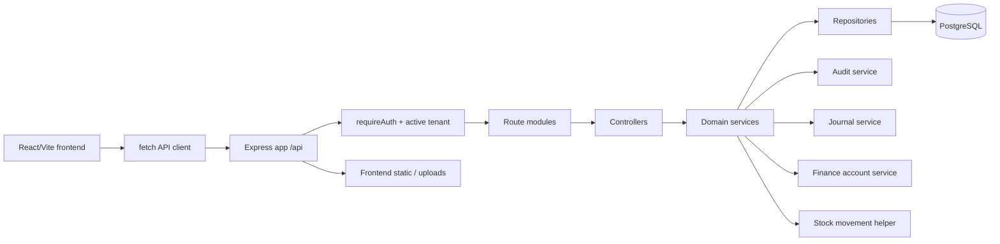
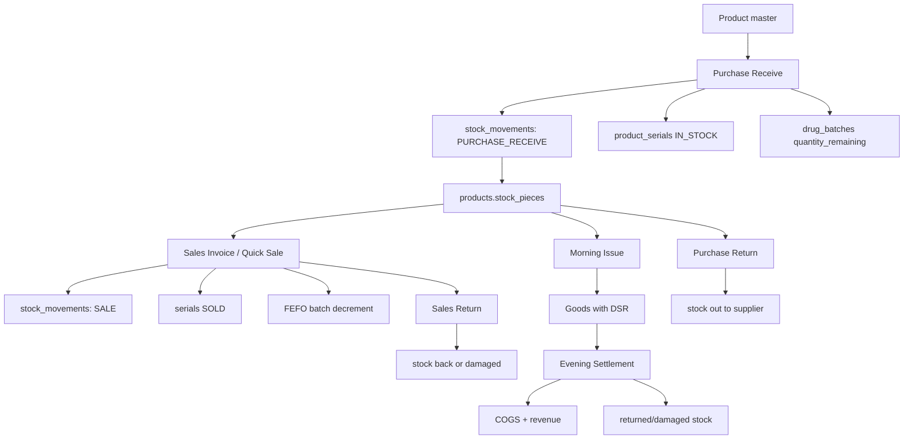
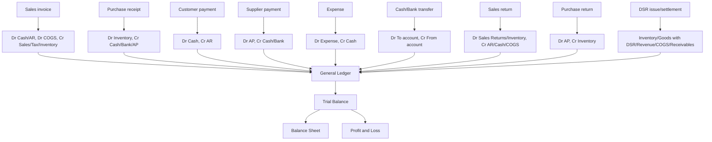
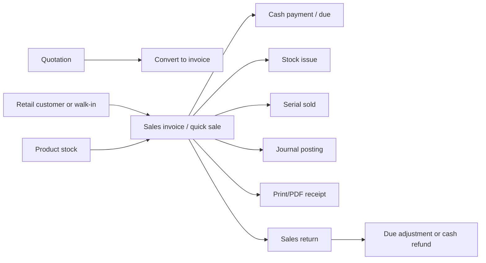
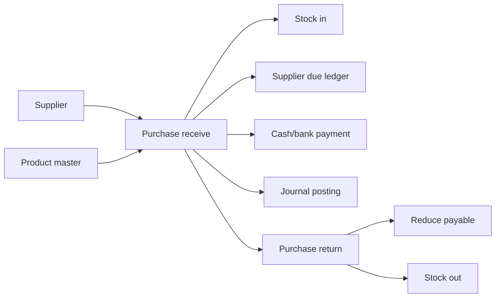

# ERP Gap Analysis

Audit date: 2026-07-09  
Scope: `backend`, `frontend`, `api`, and project scripts in this repository.  
Method: static code review of schema, routes, services, repositories, middleware, frontend routes/pages, API client, and tests. No production data was inspected.

## 1. Executive Summary

This product is no longer a simple inventory app. It is a multi-tenant Node/Express + React/Vite business system with POS, purchases, supplier/customer ledgers, DSR field sales, finance accounts, cash sessions, product serials, warranty/repair, promotions, HR/payroll basics, feature flags, RBAC, audit logs, backups, and an additive double-entry journal.

Commercially, it is closer to a strong vertical retail/distribution management system than a complete ERP/accounting platform. The biggest release blockers are not UI polish; they are accounting depth, database governance, stock valuation, auditability, compliance, operations, and missing end-to-end documents such as sales orders, delivery notes, purchase requests, purchase orders, bank reconciliation, fiscal periods, tax/VAT returns, and configurable chart of accounts.

The codebase has several strong foundations:

- Multi-tenant schema and active tenant guard exist in `backend/db/schema.js:16`, `backend/middleware/requireAuth.js:50`, and `backend/middleware/requireActiveTenant.js:1`.
- Server-side RBAC and tenant feature flags exist in `backend/middleware/requireRole.js:4`, `backend/middleware/requireFeature.js:5`, `backend/lib/permissions.js:3`, `backend/db/schema.js:348`, and `backend/db/schema.js:355`.
- Backend is layered by controller/service/repository under `backend/controllers`, `backend/services`, and `backend/repositories`.
- Accounting journal tables exist in `backend/db/schema.js:2056`, `backend/db/schema.js:2064`, and `backend/db/schema.js:2085`.
- Journal posting validates balanced debits and credits in `backend/services/journalService.js:46`.
- Stock movement ledger and negative stock checks exist in `backend/db/schema.js:109`, `backend/services/salesInvoiceService.js:450`, `backend/services/purchaseReceiveService.js:118`, and `backend/services/purchaseReturnService.js:100`.
- Serial/IMEI and pharmacy batch/FEFO support exist in `backend/db/schema.js:1068`, `backend/db/schema.js:1925`, and `backend/services/salesInvoiceService.js:211`.
- Tests cover many core flows under `backend/tests`.

The main commercial risks:

- Accounting is additive and partial, not the system of record. `backend/services/journalService.js:35` explicitly says it is a purely additive posting layer and does not read business tables back.
- Chart of accounts is fixed and global. `backend/lib/chartOfAccounts.js:1` states it is identical for every tenant.
- No fiscal year, accounting period lock, closing entries, bank reconciliation, tax return workflow, multi-currency, depreciation, accruals, or configurable voucher system.
- Inventory has product-level stock, but no warehouse/bin/location dimension in schema. No FIFO/weighted-average valuation layers for non-pharmacy inventory.
- Business workflows skip core ERP documents: sales order, delivery note, purchase request, purchase order, goods receive against PO, purchase invoice separation, approvals, and document lifecycle states.
- Operational readiness is incomplete: no automated restore drill, observability stack, background job system, SLO monitoring, API docs, support impersonation controls, billing/subscription enforcement, or deployment-grade migration system.

## 2. Architecture Overview

Backend:

- Runtime: Node.js, Express 5, PostgreSQL via `pg`, serverless adapter support through `@vendia/serverless-express` (`backend/package.json`).
- Entry: `backend/server.js`, `backend/app.js`, `backend/routes/api.js`.
- Structure: controllers call services; services call repositories; middleware handles auth/RBAC/features/rate limits/uploads.
- Schema: one large boot-time schema/backfill file in `backend/db/schema.js`, not a conventional migration history.
- Tests: Node test runner + Supertest under `backend/tests`.

Frontend:

- Runtime: React 18, Vite, Tailwind, lucide icons, Chart.js, jsPDF/html2canvas/xlsx (`frontend/package.json`).
- Entry: `frontend/src/main.jsx`, `frontend/src/app/App.jsx`.
- Routing: central `APP_ROUTES` with permissions/features in `frontend/src/app/routes.js:107`.
- API: fetch wrappers in `frontend/src/services/api/client.js`.
- State: `InventoryAppProvider` in `frontend/src/app/useInventoryApp.jsx` manages auth, directories, permissions, tenant switching, and common save/delete operations.

Deployment:

- Vercel functions in `api/[...path].js` and `api/index.js`.
- SAM config exists, suggesting AWS Lambda deployment history.
- Render config exists for frontend.

## 3. Existing Modules

| Module | Purpose | Pages | APIs | Tables | Services | Roles | Strengths | Weaknesses / Missing |
|---|---|---|---|---|---|---|---|---|
| Platform/Tenants | Tenant lifecycle and platform admin | `/platform`, registrations, chats, contact messages | `/platform/tenants`, `/platform/registrations`, `/platform/backup` | `tenants`, `tenant_features`, registration/contact/chat tables | `tenantService`, `registrationService`, `backupService` | `system_developer` | Multi-tenant foundation, feature flags | No billing, tenant limits, subscription enforcement beyond status/plan text |
| Auth/Profile/Sessions | Login, logout, password reset, profile, session tracking | `/login`, `/profile`, `/security` | `/auth`, `/profile` | `users`, `user_sessions`, `login_history`, `password_reset_tokens` | `authService`, `userService` | all | Session table, login history, lockout fields | No MFA, no password policy config, CSRF protection not evident |
| RBAC/Permissions | Role permission management | `/settings/permissions`, `/settings/users` | `/permissions`, `/users` | `role_permissions`, `users` | `permissionService`, `userService` | system developer, super admin | Server-side route permissions | Permission vocabulary is code-defined; no scoped field/action policy model |
| Product Catalog | Products, categories, brands, manufacturers, generic medicines | `/products` | `/products`, `/categories`, `/brands`, `/manufacturers`, `/generic-medicines` | `products`, `categories`, `brands`, `manufacturers`, `generic_medicines`, `product_suppliers` | `productService`, category/brand/manufacturer services | product permissions | SKU/barcode indexes, category/brand support | No product variants, price lists, UOM conversions, warehouse dimensions |
| Stock Movement | Stock ledger/reporting | `/stock-movement`, `/low-stock-alerts` | `/stock-movements` | `stock_movements`, `products` | `stockMovementService` | product/view state | Movement log with references | No warehouse/bin, no valuation layers, no period stock close |
| Serial/IMEI | Electronics/mobile serial tracking | `/product-serials` | `/product-serials` | `product_serials`, `product_serial_identifiers`, `sales_item_serials` | `productSerialService` | serial permissions | Purchase and sale serial enforcement | No bulk import scanner workflow, no serial audit status lifecycle beyond core states |
| Batch/Expiry | Pharmacy/grocery expiry tracking | batch report page | `/drug-batches` | `drug_batches`, `sales_invoice_item_batches` | `drugBatchService`, purchase/sales services | batch permissions | FEFO consumption for batches | Not generalized as lot/batch inventory for all products; no recall workflow |
| POS/Sales Invoices | Retail/wholesale/quick sale invoices | quick sale, sales invoices, daily sales report | `/sales-invoices` | `sales_invoices`, `sales_invoice_items`, `sales_number_counters` | `salesInvoiceService` | sales permissions | Stock, due, cash, loyalty, tax, journal posting | No sales order/delivery note, no edit invoice, no e-invoice/VAT return |
| Quotations | Quote creation and conversion | `/quotations` | `/quotations` | `quotations`, `quotation_items`, counters | `quotationService` | quotation permissions | Quote-to-sale conversion exists | No approval, expiry automation, quote revisions |
| Sales Returns | Return/refund flow | `/retailer/sales-return` | `/sales-returns` | `sales_returns`, `sales_return_items` | `salesReturnService` | sales return permissions | Reverses stock/due/cash/journal | No exchange workflow, RMA status, refund approval |
| Retail Customers | Customer master, loyalty, retention | `/retail-customers`, retention, due pages | `/retail-customers`, `/customer-due-ledger`, `/customer-payments` | `retail_customers`, `retail_loyalty_ledger`, `customer_due_ledger`, `customer_payments` | `retailCustomerService`, `customerPaymentService` | customer permissions | AR-like due ledger and loyalty | No credit limits, aging buckets as core AR, customer portal |
| Suppliers | Supplier master and payable ledger | `/suppliers`, supplier statement | `/suppliers`, `/supplier-due-ledger` | `suppliers`, `supplier_due_ledger` | `supplierService`, `supplierDueLedgerService` | supplier permissions | Supplier statements and current due | No vendor portal, credit terms, AP aging maturity |
| Purchase Receive | Purchase receipts and stock-in | `/purchase-receive` | `/purchase-receive` | `purchase_receipts`, `purchase_receipt_items`, counters | `purchaseReceiveService` | purchase permissions | Stock, supplier due, cash/bank, journal posting | No purchase request/order; receipt and invoice are merged |
| Purchase Returns | Return stock to supplier | `/purchase-returns` | `/purchase-returns` | `purchase_returns`, `purchase_return_items` | `purchaseReturnService` | purchase return permissions | Reduces stock and supplier payable | Not linked to original receipts; no approval/credit note document |
| Supplier Payments/Discounts | AP settlement and supplier discounts | `/supplier-payments`, `/supplier-discounts` | `/supplier-payments`, `/supplier-discounts` | `supplier_payments`, `supplier_discounts` | payment/discount services | supplier payment permissions | Finance account and journal integration | No bank reconciliation, payment run, check/transfer register |
| Finance Accounts | Cash/bank account balances and transfers | `/finance-accounts`, finance dashboard | `/finance-accounts`, `/finance-dashboard` | `finance_accounts`, `finance_account_transactions` | `financeAccountService`, `financeDashboardService` | finance permissions | Cash/bank/petty-cash-like accounts and transfers | No reference columns, noted in `invariantService`; no reconciliation/import |
| Accounting Journal | GL, trial balance, BS, P&L | `/general-ledger`, `/trial-balance`, `/balance-sheet`, `/profit-and-loss` | `/journal` | `chart_of_accounts`, `journal_entries`, `journal_lines` | `journalService` | accounting permissions | Balanced journal postings for many flows | Fixed COA, no manual journal UI, no periods, no cash flow statement |
| DSR Field Sales | Morning issue, settlement, DSR finance, targets | `/dsrs`, `/morning-issue`, `/settlements`, `/dsr-finance` | `/dsrs`, `/issues`, `/settlements`, `/dsr-due-ledger`, `/dsr-targets` | `dsrs`, `issues`, `settlements`, `dsr_due_ledger`, `dsr_advances`, `dsr_targets` | DSR/issue/settlement services | DSR permissions | Strong distributor/dealer workflow | Domain-specific, not generalized as route sales module with van stock/route plan |
| Shops/SRs | Dealer/shop/customer and sales rep ledgers | `/customers`, `/shop-due-ledger`, `/srs`, `/sr-due-ledger` | `/customers`, `/shop-due-ledger`, `/srs`, `/sr-due-ledger` | `customers`, `shop_due_ledger`, `srs`, `sr_due_ledger` | customer/shop/SR services | customer/SR permissions | Dealer ledger support | Separate from retail customer AR; duplicates customer concepts |
| Cash Sessions | POS shift/session close | `/retailer/cash-sessions` | `/retail-cash-sessions` | `retail_cash_sessions` | `retailCashSessionService` | quick sale permissions | Active session uniqueness | No cashier drawer audit with payment method reconciliation |
| Promotions/Loyalty | Retail promotion rules and points | `/retailer/promotions`, retention | `/retail-promotions` | `retail_promotions`, `retail_loyalty_ledger` | `retailPromotionService`, sales logic | promotion/customer permissions | Promotion engine in sales service | No coupon/voucher campaigns or full loyalty liability accounting |
| Warranty/Repair | Warranty claims and repair jobs | `/warranty-claims`, `/repair-jobs` | `/warranty-claims`, `/repair-jobs` | `warranty_claims`, `repair_jobs` | warranty/repair services | warranty permissions | Valuable for electronics/mobile shops | No spare parts billing integration or technician commission |
| HR/Payroll | Employees and salary payments | `/hr/employees`, `/hr/salary` | `/employees`, `/salary-payments` | `employees`, `salary_payments`, `salary_active_days` | `employeeService`, `salaryPaymentService` | HR/payroll permissions | Basic employee/payroll | No attendance, statutory deductions, payslips, payroll liabilities |
| Expenses/Profit | Operating expense and profit report | `/expenses`, `/profit` | `/expenses`, `/profit-report` | `expenses` plus sales/purchase tables | `expenseService`, `profitService` | finance permissions | Simple operating expense tracking | Profit report duplicates accounting P&L concepts |
| Reports/Audit/System | Activity logs, audit, exports, health, invariants, backups | reports/activity/system pages | `/activity-logs`, `/audit`, `/report-exports`, `/system`, `/database-backup` | `activity_logs`, `error_logs` | `auditService`, `systemService`, `invariantService`, `backupService` | reports/system | Audit trails and invariant checks | No full observability, immutable audit store, scheduled backups, restore automation |
| Help/Visitor Chat | Support ticket and visitor chat | `/help-desk`, visitor chat pages | `/help-desk`, `/visitor-chat` | help desk and visitor chat tables | `helpDeskService`, `visitorChatService` | tenant/platform | Commercial support foundation | No SLA, assignment queue, canned replies, support impersonation audit |

Partially implemented modules: accounting, tax/VAT, finance accounts, backup/restore, HR/payroll, inventory valuation, batch tracking outside pharmacy, DSR route sales, reports/exports, permissions, and commercial subscription management.

## 4. Module Dependency Map

- Sales depends on Product, Retail Customer, Promotions, Loyalty, Stock Movement, Product Serials, Drug Batches, Customer Due Ledger, Finance Accounts, Journal, Audit.
- Purchase Receive depends on Supplier, Product, Product Serials, Drug Batches, Supplier Due Ledger, Finance Accounts, Journal, Audit.
- Sales Return depends on Sales Invoice, Product, Customer Due Ledger, Finance Accounts, Journal.
- Purchase Return depends on Supplier, Product, Supplier Due Ledger, Stock Movement, Journal.
- DSR Settlement depends on DSR, Morning Issues, Products, Stock Movement, DSR Due Ledger, Shop/SR ledgers, Supplier Discounts, Finance Accounts, Journal.
- Finance Dashboard depends on finance transactions, expenses, purchases, sales, profit logic.
- Accounting reports depend only on journal tables, not subledgers or source tables.
- Frontend routes depend on permissions and features from auth/session responses.

## 5. Mermaid Architecture Diagram

## 6. Mermaid ER Diagram

```mermaid
erDiagram
  tenants ||--o{ users : owns
  tenants ||--o{ tenant_features : enables
  tenants ||--o{ role_permissions : configures
  users ||--o{ user_sessions : has
  tenants ||--o{ products : owns
  products ||--o{ stock_movements : moves
  products ||--o{ product_serials : serializes
  suppliers ||--o{ purchase_receipts : supplies
  purchase_receipts ||--o{ purchase_receipt_items : contains
  products ||--o{ purchase_receipt_items : received
  suppliers ||--o{ supplier_due_ledger : payable
  suppliers ||--o{ supplier_payments : paid
  retail_customers ||--o{ sales_invoices : buys
  sales_invoices ||--o{ sales_invoice_items : contains
  products ||--o{ sales_invoice_items : sold
  retail_customers ||--o{ customer_due_ledger : receivable
  retail_customers ||--o{ customer_payments : pays
  sales_invoices ||--o{ sales_returns : returned
  finance_accounts ||--o{ finance_account_transactions : posts
  chart_of_accounts ||--o{ journal_lines : account
  journal_entries ||--o{ journal_lines : lines
  tenants ||--o{ journal_entries : posts
  dsrs ||--o{ issues : receives
  dsrs ||--o{ settlements : settles
  dsrs ||--o{ dsr_due_ledger : owes
```

## 7. Mermaid Inventory Flow Diagram

## 8. Mermaid Accounting Flow Diagram

## 9. Mermaid Sales Workflow

Missing in this workflow: lead, sales order, approval, delivery note, shipment, invoice edit workflow, email/SMS/WhatsApp dispatch, credit limit approval, and full document status lifecycle.

## 10. Mermaid Purchase Workflow

Missing in this workflow: purchase request, RFQ, purchase order, approval, goods receive note separate from supplier invoice, landed cost, three-way match, payment run, supplier credit note, and receiving quality inspection.

## 11. Accounting Audit

Implemented:

- Fixed chart of accounts seeded in `backend/db/schema.js:2056` and mirrored in `backend/lib/chartOfAccounts.js:1`.
- Journal entries and journal lines in `backend/db/schema.js:2064` and `backend/db/schema.js:2085`.
- Balanced journal validation in `backend/services/journalService.js:46`.
- Unique live journal entry per source in `backend/db/schema.js:2079`.
- Postings exist for sales, purchases, payments, expenses, finance transfers, returns, DSR issue/settlement in `backend/services/journalService.js:187` through `backend/services/journalService.js:466`.
- General ledger, trial balance, balance sheet, and P&L report methods in `backend/services/journalService.js:529` and `backend/services/journalService.js:564`.
- Transaction hash columns added to money movement tables in `backend/db/schema.js:1983`.

Accounting gaps and issues:

- Chart of accounts is global/fixed, not tenant-specific or configurable (`backend/lib/chartOfAccounts.js:1`).
- Accounting is additive and not authoritative (`backend/services/journalService.js:35`). Subledgers do not reconcile automatically to GL in enforceable workflows.
- No fiscal year table, accounting periods, period lock, closing entries, retained earnings close, or opening balance journal import.
- No manual journal voucher UI/API visible beyond reporting routes.
- No voucher numbering system for receipt/payment/contra/journal/expense vouchers.
- No bank reconciliation, bank statement import, check register, or reconciled flags on finance transactions.
- No cash flow statement.
- No depreciation/fixed assets module.
- No accrual/prepayment/adjusting entry workflow.
- No multi-currency/exchange rate/gain-loss tables.
- Tax is simple rate/amount on sales and purchases (`backend/db/schema.js:213`-`216`); no VAT return, input/output VAT ledger, tax codes, exemptions, withholding, or jurisdiction logic.
- Customer payments are hardcoded to CASH in journal comments and service behavior (`backend/services/journalService.js:247`), limiting payment method accuracy.
- Finance transaction invariants state `finance_account_transactions` has no `reference_type/reference_id`, preventing 1:1 source reconciliation (`backend/services/invariantService.js:4` and `backend/services/invariantService.js:337`).
- Purchase receipt posts total amount to Inventory including tax (`backend/services/journalService.js:207`), which may be wrong when input VAT is recoverable.
- Sales tax is credited to Tax Payable, but purchase tax is not posted to Input VAT; this overstates inventory for VAT-registered entities.
- Loyalty redemption reduces revenue/profit in sales service, but no explicit loyalty liability accounting.
- Supplier/customer ledgers allow negative balances as credits/advances, but there is no refund/credit-note workflow to manage them commercially.
- Reports are limited to GL/TB/BS/P&L; no AR/AP aging, cash flow, voucher register, tax summary, audit journal, account drilldown by source document across all flows.

Accounting score: 45/100. The double-entry engine is real and valuable, but the accounting product is not yet a CPA-ready SMB accounting system.

## 12. Inventory Audit

Implemented:

- Products, categories, brands, manufacturers, generic medicines.
- Product stock quantity and stock movements (`backend/db/schema.js:97`, `backend/db/schema.js:109`).
- Stock movements include reference type/id and business date (`backend/db/schema.js:281`-`297`, `backend/db/schema.js:884`).
- Negative stock prevention appears in sales, purchase edits, purchase returns, quotation conversion, trade-ins, issues, and settlements.
- Product serials/IMEI tables and sales item serial links (`backend/db/schema.js:1068`, `backend/db/schema.js:1139`).
- Drug batches, expiry, FEFO allocation (`backend/db/schema.js:1925`, `backend/db/schema.js:1961`, `frontend/src/app/routes.js:130` for serial UI).
- Damaged stock page and stock movement damaged report route.
- Low-stock alerts page exists (`frontend/src/app/routes.js:129`).

Missing:

- Warehouses, bins, shelves, locations, routes/van warehouses.
- Stock transfers between warehouses.
- Reservation/commitment quantities for quotations/orders.
- FIFO/weighted-average valuation layers for normal inventory.
- Landed cost allocation.
- Unit of measure conversion beyond `pieces_per_case`.
- Reorder planning by supplier/warehouse/lead time.
- Cycle count and stocktake approval.
- Barcode label printing and scanner-first workflows are incomplete from schema/page evidence.
- Batch/lot generalized for grocery/FMCG, not only drug-specific tables.
- Expiry alerts as a general inventory page are not in routes; batch sales report exists.
- No inventory close/revaluation.

Inventory score: 62/100. Quantity control is respectable for single-location retail/distribution; valuation and warehouse-grade inventory are incomplete.

## 13. Business Workflow Audit

Customer flow:

- Exists: retail customer, quotation, invoice, payment/due, receipt/print components, sales return.
- Missing: lead, sales order, delivery note, shipment, approval, draft/submit/post lifecycle, credit limit approval, email/SMS/WhatsApp dispatch, customer portal.

Supplier flow:

- Exists: supplier, purchase receive, purchase invoice-like receipt, payment, purchase return, supplier statement.
- Missing: purchase request, RFQ, purchase order, goods receive against PO, separate supplier invoice, three-way match, quality inspection, landed cost, vendor portal.

General workflow:

- Some documents require delete/edit reason and audit entries.
- No general approval workflow engine.
- No workflow statuses across all documents.
- Draft mode is not systematic.
- PDF/print exists in many frontend components, but no server-side document rendering/archive.
- No notification center, email/SMS/WhatsApp integrations for transactional documents.

Business workflow score: 54/100.

## 14. Database Audit

Strengths:

- Tenant IDs and indexes exist across most core tables.
- Many foreign keys exist for core relations.
- Unique document number indexes for sales/purchases.
- Soft delete columns are broadly present.
- Ledger and stock invariant checks exist in `backend/services/invariantService.js`.

Risks:

- `backend/db/schema.js` is a large boot-time schema/backfill script, not controlled migrations. This is risky for 10,000 tenants.
- Backfills assign NULL tenant rows to the first tenant in several places (`backend/db/schema.js:915`, `backend/db/schema.js:920`, `backend/db/schema.js:929`, `backend/db/schema.js:963`). That is dangerous if ever run on inconsistent production data.
- No warehouse/location tables.
- Many money columns use `NUMERIC` without precision/scale.
- Some early tables were created without tenant NOT NULL and later altered; migration drift risk is high.
- Some references use snapshots or text fields instead of normalized FKs, useful for audit but inconsistent.
- No accounting periods, fiscal years, tax codes, currencies, exchange rates, addresses, contact persons, payment terms.
- No database row-level security.
- No partitioning/archival strategy for logs, stock movements, journal lines, and ledger tables.

Database score: 58/100.

## 15. Security Audit

Strengths:

- `x-powered-by` disabled and security headers set in `backend/app.js:11`-`21`.
- JSON body limit set to 1 MB in `backend/app.js:26`.
- Server-side auth middleware and active tenant checks exist.
- Route permissions and feature gates exist.
- Login rate limiter exists for public auth route.
- Password reset tokens and login history tables exist.
- Upload size and MIME allowlist exist in `backend/middleware/upload.js:10`-`25`.
- Queries use parameterized SQL in repositories.

Concerns:

- No CSRF protection is visible while cookie credentials are used by the frontend API client.
- Rate limiter is in-memory (`backend/middleware/rateLimiter.js:3`), ineffective across multiple instances/restarts.
- Upload validation trusts MIME type; no magic-byte validation, virus scanning, image re-encoding, or private object storage.
- `/uploads` is publicly served from backend filesystem (`backend/app.js:27`).
- No MFA, SSO, IP allowlist, device trust, or session anomaly detection.
- No explicit secure cookie review in this audit; cookie config should be verified in `backend/lib/cookies.js`.
- Audit log is mutable database data, not append-only/immutable.
- Platform user can switch active tenant by header (`backend/middleware/requireAuth.js:50`); this is intentional but must have stronger audit/approval in production support.
- No CSP header.
- No API schema validation library; validation is service-level and inconsistent.

Security score: 61/100.

## 16. API Audit

Strengths:

- REST-like resources are grouped in `backend/routes/api.js`.
- Server-side auth/RBAC/feature checks exist on most routes.
- Pagination helpers are used in many list services.
- Public endpoints have rate limiting where most exposed: login, registration, contact, visitor chat.

Gaps:

- No OpenAPI/Swagger documentation.
- No generated typed client.
- Naming is mixed: `/purchase-receive`, `/profit-report`, `/retailer/...`, `/dsr-advances`, `/journal`.
- Some modules expose reports under module-specific paths; report/export behavior is not uniform.
- Filtering/sorting/search is uneven across modules.
- No idempotency keys for financial document creation.
- No API versioning.
- No standardized validation/error envelope beyond `{ message }`.
- No batch import/export APIs for master data and opening balances.

API score: 63/100.

## 17. Frontend Audit

Strengths:

- Central route registry with permission/feature metadata in `frontend/src/app/routes.js:107`.
- Route guard logic exists in `frontend/src/app/App.jsx`.
- Shared app layout, sidebar, mobile menu, command palette, confirmation dialog.
- Lazy loading and loading states exist.
- Bengali/English locale files exist.
- Print/PDF components exist for invoices, quotations, purchase receipts, statements.

Gaps:

- No design-system-level accessibility audit. Focus traps, aria labeling, keyboard table navigation, and screen reader flows need verification.
- Tables need consistent column chooser, saved views, density, export, filtering, sorting, and bulk actions.
- Mobile POS/offline mode is not present.
- Error/loading/empty states are uneven across pages.
- Many forms likely implement local validation manually; no shared schema validation.
- No Playwright/E2E regression suite for critical business workflows.
- No onboarding wizard or demo data loader in UI.

UI/UX score: 64/100.

## 18. Code Quality Audit

Strengths:

- Clear backend layering.
- Service transactions are used heavily for multi-table operations.
- Many domain tests exist.
- Common helpers for pagination, normalizers, IDs, audit, stock movements.
- Invariant service shows strong engineering awareness.

Risks:

- Very large services (`salesInvoiceService`, `purchaseReceiveService`, `useInventoryApp`) carry many responsibilities.
- Schema management is centralized but too large and risky for production change control.
- Domain concepts are split between retail customers, shops, DSRs, SRs, suppliers, ledgers, and finance accounts; boundaries need consolidation.
- Accounting, profit report, finance account balances, and subledgers duplicate financial truth.
- No TypeScript or runtime schema validation.
- No clear dependency injection framework, though composition registry exists.
- No frontend tests found in the file listing.

Code quality score: 66/100.

## 19. ERP Gap Analysis

Critical before selling:

- Fiscal year, accounting period lock, opening balance import, and closing process.
- Tenant-configurable chart of accounts.
- Manual journal, receipt/payment/contra/journal vouchers with numbering and approval.
- Bank reconciliation.
- AR/AP aging, customer/supplier statement reconciliation with GL.
- Warehouse/location model or explicit single-location product positioning.
- Stock valuation layers and inventory valuation report.
- Purchase order and sales order workflows.
- Database migration system with rollback/backup policy.
- API documentation and role/permission matrix.
- Backup restore verification.
- CSRF protection and production-grade rate limiting.
- Commercial terms: subscription, tenant limits, license enforcement.

Important:

- Delivery notes, goods receive notes, supplier invoices separated from receipts.
- Approval workflow engine.
- Tax/VAT return module.
- Import/export for products, customers, suppliers, opening stock, opening balances.
- Advanced reports with saved filters/export.
- Notifications and email/SMS/WhatsApp document sending.
- E2E test suite for financial workflows.
- Monitoring, structured logs, alerts.
- Multi-warehouse and transfer workflow.
- Price lists, discounts, customer groups, credit limits.

Nice to have:

- Multi-currency.
- Fixed assets.
- Manufacturing/BOM/light assembly.
- Customer/vendor portals.
- Native mobile app/offline POS.
- AI assistant for reports and anomaly detection.
- Marketplace integrations.

## 20. Commercial Readiness Analysis

Commercial blockers:

- No documented deployment, backup, restore, monitoring, incident response, or data retention policy.
- No onboarding wizard, demo company, import templates, or first-run setup checklist.
- No subscription billing or usage limits.
- No SLA/support tooling beyond basic help desk/chat.
- No API documentation or integration keys.
- No compliance package for audit logs, data exports, privacy, and deletion.
- No fiscal localization packs for Bangladesh VAT/tax, currency formatting, invoice requirements, or other target markets.
- No automated regression suite for frontend workflows.
- No performance/load testing for large tenants.
- No immutable financial audit trail.

Commercial readiness score: 42/100.

## 21. Risk Assessment

| Risk | Severity | Evidence | Business Impact |
|---|---:|---|---|
| Accounting is partial/additive | Critical | `backend/services/journalService.js:35` | Financial reports may not be trusted by accountants |
| Fixed COA | Critical | `backend/lib/chartOfAccounts.js:1` | Different businesses cannot map accounts correctly |
| No periods/closing | Critical | No fiscal/period tables in schema list | Backdated edits can alter historical accounts |
| No warehouse model | High | No `warehouses` table; product stock is single quantity | Cannot serve multi-branch distributors |
| Boot-time schema backfills | High | `backend/db/schema.js` large ALTER/backfill script | Production upgrade risk |
| No bank reconciliation | High | Finance tables have no reconciled fields | Cash/bank balances not audit-grade |
| In-memory rate limit | Medium | `backend/middleware/rateLimiter.js:3` | Weak protection in scaled deployments |
| Upload trust by MIME | Medium | `backend/middleware/upload.js:10` | File security risk |
| No API docs/versioning | Medium | No OpenAPI files found | Integration/support friction |
| No frontend E2E | Medium | No Playwright/Cypress test suite found | Regressions in POS/accounting flows |

## 22. Scoring

| Area | Score | Why |
|---|---:|---|
| ERP Completeness | 55 | Many modules exist, but core ERP documents/workflows are missing. |
| Accounting Completeness | 45 | Double-entry exists, but no periods, configurable COA, bank rec, vouchers, tax returns, cash flow. |
| Inventory Completeness | 62 | Strong single-stock movement model, serial/batch support, but no warehouses or valuation layers. |
| Business Workflow Completeness | 54 | POS/purchase/DSR flows exist; sales order, PO, delivery, approvals absent. |
| Security | 61 | Server auth/RBAC and headers exist; CSRF/MFA/distributed rate limits/upload hardening missing. |
| Code Quality | 66 | Good layering and tests; large services, weak migration system, duplicated financial truth. |
| Database Design | 58 | Broad schema but migration/normalization/period/warehouse/currency gaps. |
| API Design | 63 | Resource routes and permissions exist; no versioning/docs/idempotency/consistent filters. |
| UI/UX | 64 | Rich navigation/pages; inconsistent advanced table UX, accessibility, offline, onboarding. |
| Scalability | 49 | No load strategy, partitioning, distributed rate limit, migrations, observability. |
| Maintainability | 62 | Layered code helps; schema and large services are long-term risks. |
| Commercial Readiness | 42 | Missing operations, billing, docs, compliance, onboarding, support readiness. |
| Production Readiness | 50 | Functional app, but production controls are not enterprise-grade. |

## 23. Top 100 Improvements Sorted by ROI

| # | Improvement | Priority | Value | Complexity | Effort | Dependencies | Risk |
|---:|---|---|---|---|---|---|---|
| 1 | Add fiscal years and accounting periods with lock dates | P0 | High | M | 2w | Journal | High |
| 2 | Tenant-configurable chart of accounts | P0 | High | H | 3w | Journal schema | High |
| 3 | Manual journal voucher UI/API | P0 | High | M | 2w | COA | High |
| 4 | Receipt/payment/contra/journal voucher numbering | P0 | High | M | 2w | Finance accounts | High |
| 5 | Bank reconciliation workflow | P0 | High | H | 3w | Finance tx refs | High |
| 6 | Add `reference_type/reference_id` to finance transactions | P0 | High | M | 1w | Finance service | Medium |
| 7 | AR/AP aging reports | P0 | High | M | 1.5w | Customer/supplier ledgers | Medium |
| 8 | Opening balance import for GL, stock, customers, suppliers | P0 | High | H | 3w | Periods/COA | High |
| 9 | Database migration framework | P0 | High | H | 2w | Deployment | High |
| 10 | Backup restore drill and restore UI | P0 | High | M | 1.5w | Backup service | High |
| 11 | CSRF protection for cookie auth | P0 | High | M | 1w | API client | High |
| 12 | Distributed rate limiting | P0 | High | M | 1w | Redis/store | Medium |
| 13 | API idempotency keys for financial creates | P0 | High | M | 1.5w | Schema | High |
| 14 | Purchase order workflow | P0 | High | H | 3w | Suppliers/products | Medium |
| 15 | Sales order workflow | P0 | High | H | 3w | Customers/products | Medium |
| 16 | Document status model: draft/submitted/posted/void | P0 | High | H | 3w | Core documents | High |
| 17 | Immutable audit trail for financial postings | P0 | High | H | 2w | Audit service | High |
| 18 | Standard validation schema layer | P0 | High | M | 2w | Controllers | Medium |
| 19 | Stock valuation report | P0 | High | H | 3w | Valuation layers | High |
| 20 | Production monitoring/logging/alerts | P0 | High | M | 1.5w | Hosting | Medium |
| 21 | OpenAPI documentation | P1 | High | M | 1.5w | Routes | Low |
| 22 | Import/export templates | P1 | High | M | 2w | Validation | Medium |
| 23 | Warehouse/location tables | P1 | High | H | 4w | Stock refactor | High |
| 24 | Stock transfer workflow | P1 | High | M | 2w | Warehouses | Medium |
| 25 | Delivery notes | P1 | High | M | 2w | Sales orders | Medium |
| 26 | Goods receive note separate from purchase invoice | P1 | High | H | 3w | PO | High |
| 27 | VAT/tax codes and tax return report | P1 | High | H | 3w | COA/tax schema | High |
| 28 | Credit limits and overdue blocking | P1 | High | M | 1.5w | Customers | Medium |
| 29 | Approval workflow engine | P1 | High | H | 3w | Status model | High |
| 30 | E2E tests for POS/purchase/accounting | P1 | High | M | 2w | Test infra | Medium |
| 31 | Consistent table filters/sorting/export | P1 | Medium | M | 2w | UI components | Low |
| 32 | Server-side PDF archive | P1 | Medium | M | 2w | Document service | Medium |
| 33 | Email document sending | P1 | Medium | M | 2w | Email service | Medium |
| 34 | Tenant billing/subscription limits | P1 | High | H | 3w | Plans | High |
| 35 | Onboarding wizard/demo company | P1 | Medium | M | 1.5w | Seed data | Low |
| 36 | Role matrix documentation and presets | P1 | Medium | S | 1w | Permissions | Low |
| 37 | Cash drawer reconciliation by payment method | P1 | High | M | 2w | Cash sessions | Medium |
| 38 | Payment methods registry | P1 | Medium | M | 1w | Finance accounts | Medium |
| 39 | Customer/supplier credit note module | P1 | High | M | 2w | AR/AP | Medium |
| 40 | Period close inventory snapshot | P1 | High | H | 3w | Valuation | High |
| 41 | Multi-branch tenant settings | P2 | High | H | 4w | Warehouses | High |
| 42 | Price lists/customer groups | P2 | High | M | 2w | Sales | Medium |
| 43 | Landed cost allocation | P2 | Medium | H | 3w | Purchases/valuation | High |
| 44 | FIFO/weighted-average costing engine | P2 | High | H | 4w | Valuation schema | High |
| 45 | Product variants | P2 | Medium | H | 3w | Catalog | Medium |
| 46 | UOM conversion engine | P2 | High | H | 3w | Catalog/inventory | High |
| 47 | Barcode label printing | P2 | Medium | M | 1.5w | Products | Low |
| 48 | Scanner-first POS mode | P2 | Medium | M | 2w | POS UI | Medium |
| 49 | Offline POS queue | P2 | High | H | 4w | Idempotency | High |
| 50 | Notification center | P2 | Medium | M | 2w | Events | Medium |
| 51 | WhatsApp/SMS integration | P2 | Medium | M | 2w | Notifications | Medium |
| 52 | Customer portal | P2 | Medium | H | 4w | Auth/scopes | Medium |
| 53 | Vendor portal | P2 | Medium | H | 4w | Auth/scopes | Medium |
| 54 | Stocktake/cycle count | P2 | High | M | 2w | Warehouses | Medium |
| 55 | Reorder planning | P2 | High | M | 2w | Supplier/products | Medium |
| 56 | Batch recall workflow | P2 | Medium | M | 2w | Batch tracking | Medium |
| 57 | Expiry alert dashboard | P2 | Medium | S | 1w | Drug batches | Low |
| 58 | Warranty supplier RMA workflow | P2 | Medium | M | 2w | Warranty | Medium |
| 59 | Repair spare parts consumption | P2 | Medium | M | 2w | Repair/inventory | Medium |
| 60 | Technician commission | P2 | Medium | M | 1.5w | HR/repair | Medium |
| 61 | Payroll payslips | P2 | Medium | M | 2w | HR | Medium |
| 62 | Attendance integration | P2 | Medium | M | 2w | HR | Medium |
| 63 | Fixed assets/depreciation | P2 | Medium | H | 3w | Accounting | Medium |
| 64 | Accrual/prepayment schedules | P2 | Medium | H | 3w | Accounting | Medium |
| 65 | Cash flow statement | P2 | High | M | 2w | Journal classification | Medium |
| 66 | Multi-currency | P2 | Medium | H | 5w | Accounting/sales/purchase | High |
| 67 | Exchange gain/loss posting | P2 | Medium | H | 3w | Multi-currency | High |
| 68 | API tokens/webhooks | P2 | Medium | H | 3w | Security/API docs | High |
| 69 | Audit log retention/export | P2 | Medium | M | 1.5w | Audit | Medium |
| 70 | Data retention/privacy tools | P2 | Medium | M | 2w | Compliance | Medium |
| 71 | Accessibility audit and fixes | P2 | Medium | M | 2w | UI | Medium |
| 72 | Performance indexes review | P2 | Medium | M | 1w | DB metrics | Medium |
| 73 | Background jobs queue | P2 | High | M | 2w | Infra | Medium |
| 74 | Scheduled backups | P2 | High | M | 1w | Backup | High |
| 75 | Support impersonation with approval | P2 | Medium | M | 2w | Platform/admin | High |
| 76 | Feature flag admin audit | P2 | Medium | S | 1w | Feature flags | Low |
| 77 | Demo data reset per tenant | P2 | Medium | M | 1w | Seeds | Medium |
| 78 | Localization packs | P2 | Medium | M | 2w | i18n | Low |
| 79 | Report builder basics | P2 | Medium | H | 4w | Reporting | Medium |
| 80 | Saved views | P2 | Medium | M | 1.5w | UI tables | Low |
| 81 | Mobile responsive hardening | P2 | Medium | M | 2w | UI QA | Medium |
| 82 | Field sales route plan | P2 | High | H | 3w | DSR | Medium |
| 83 | Van stock warehouse | P2 | High | H | 3w | Warehouses/DSR | High |
| 84 | DSR GPS/check-in | P3 | Medium | H | 3w | Mobile | Medium |
| 85 | Supplier payment run | P3 | Medium | H | 3w | AP/bank | Medium |
| 86 | Bank statement import rules | P3 | Medium | H | 3w | Bank rec | Medium |
| 87 | E-commerce integration | P3 | Medium | H | 4w | API/webhooks | Medium |
| 88 | Marketplace integrations | P3 | Medium | H | 5w | API | Medium |
| 89 | Manufacturing/BOM light assembly | P3 | Medium | H | 5w | Inventory valuation | High |
| 90 | Project/job costing | P3 | Medium | H | 4w | Accounting | Medium |
| 91 | Budgeting | P3 | Medium | M | 2w | Accounting | Low |
| 92 | Consolidated multi-company reporting | P3 | Medium | H | 5w | Multi-tenant accounting | High |
| 93 | Row-level security | P3 | Medium | H | 3w | DB policy | High |
| 94 | Security event SIEM export | P3 | Medium | M | 2w | Logging | Medium |
| 95 | SOC2 readiness controls | P3 | High | H | 8w | Ops/security | High |
| 96 | AI anomaly detection | P3 | Low | H | 4w | Reporting data | Medium |
| 97 | In-app guided assistant | P3 | Low | H | 4w | Docs/API | Medium |
| 98 | Advanced forecasting | P3 | Medium | H | 4w | Sales/inventory history | Medium |
| 99 | Data warehouse/BI connector | P3 | Medium | H | 4w | Reporting/API | Medium |
| 100 | Plugin/integration marketplace | P3 | Medium | H | 8w | API/auth/billing | High |

## 24. Detailed Implementation Plan

Use this delivery sequence:

1. Stabilize financial correctness: implement periods, configurable COA, finance transaction references, vouchers, bank reconciliation, and migration framework.
2. Stabilize core ERP documents: add sales orders, purchase orders, status lifecycle, approvals, delivery/GRN separation.
3. Stabilize inventory costing: add warehouse/location, valuation layers, inventory value report, stock close.
4. Harden SaaS operations: backups/restore, monitoring, billing, rate limiting, CSRF, API docs, E2E tests.
5. Expand commercial differentiators: industry workflows, portals, integrations, offline POS, reporting.

For each Top 100 item, implementation should follow this standard pattern:

- Define schema changes with versioned migrations and rollback.
- Add repository methods with tenant filters and indexes.
- Add service methods with transaction boundaries and audit logging.
- Add route with permission, feature gate, validation schema, and idempotency where money/stock changes.
- Add frontend page/modal/table actions with loading, error, empty, confirmation, and export states.
- Add tests: service happy path, authorization, tenant isolation, invalid input, delete/restore/reversal where relevant.
- Add documentation and seed/demo data.

High-risk items (#1-20, #23, #26, #27, #40, #44, #49, #66-67) require accountant/product-owner signoff before coding because they alter financial truth.

## 25. Suggested Database Changes

- Add `schema_migrations`.
- Add `fiscal_years`, `accounting_periods`, `period_locks`.
- Replace global `chart_of_accounts` with tenant-owned accounts plus system templates.
- Add `journal_batches` / voucher headers and voucher lines.
- Add `finance_account_transactions.reference_type`, `reference_id`, `reconciled_at`, `reconciliation_id`.
- Add `bank_reconciliations`, `bank_statement_imports`, `bank_statement_lines`.
- Add `warehouses`, `bins`, `stock_balances`, `stock_transfers`, `stock_transfer_items`.
- Add `inventory_valuation_layers`.
- Add `sales_orders`, `sales_order_items`, `delivery_notes`, `delivery_note_items`.
- Add `purchase_orders`, `purchase_order_items`, `goods_receipts`, `supplier_invoices`.
- Add `tax_codes`, `tax_rates`, `tax_return_periods`.
- Add `currencies`, `exchange_rates`.
- Add `approval_requests`, `approval_steps`.
- Add `document_files` for immutable PDFs.

## 26. Suggested API Changes

- Introduce `/api/v1`.
- Publish OpenAPI.
- Add idempotency key middleware for financial documents.
- Standardize list query params: `page`, `pageSize`, `search`, `sort`, `direction`, `dateFrom`, `dateTo`.
- Standardize response envelopes and validation errors.
- Add import/export endpoints.
- Add reconciliation endpoints.
- Add order/delivery/PO/GRN endpoints.
- Add webhook/API token endpoints.

## 27. Suggested Frontend Changes

- Create shared data table with sorting/filtering/export/saved views.
- Create shared document status ribbon.
- Add accountant dashboard with period lock alerts and unreconciled transactions.
- Add onboarding wizard.
- Add import mapping UI.
- Add bank reconciliation UI.
- Add warehouse transfer/stocktake UI.
- Add approval inbox.
- Add accessibility checklist and keyboard-first POS workflow.

## 28. Suggested Backend Changes

- Split large services into domain command handlers.
- Add validation schemas.
- Add domain events for stock/accounting side effects.
- Add background job queue for emails, reports, backups.
- Add distributed cache/store for rate limiting and feature/permission cache invalidation.
- Add structured logging with request IDs.
- Add E2E test fixture builders for core documents.

## 29. Suggested Report Improvements

- AR aging, AP aging.
- Cash flow statement.
- Inventory valuation.
- Stock aging, dead stock, expiry, reorder.
- VAT/tax summary and return.
- Sales by product/customer/category/salesperson.
- Purchase by supplier/product.
- Gross margin by invoice/product/customer.
- Reconciliation exceptions.
- Audit trail by document and user.

## 30. Suggested Accounting Improvements

- Configurable COA templates by business type.
- Manual journal vouchers.
- Voucher numbering by fiscal year.
- Period close and retained earnings.
- Bank reconciliation.
- Input/output VAT.
- Accruals, depreciation, prepayments.
- Credit/debit notes.
- Multi-currency.
- GL-subledger reconciliation dashboards.

## 31. Suggested Inventory Improvements

- Warehouses, bins, transfers.
- FIFO/weighted average costing.
- Landed cost.
- Stocktake/cycle count.
- Reservation quantities.
- Reorder planning.
- Product variants and UOM conversion.
- Barcode label printing.
- Batch/expiry recall.
- Multi-branch stock visibility.

## 32. Suggested Performance Optimizations

- Add query telemetry and slow query logs.
- Review indexes for ledgers, journals, stock movements, audit logs, sales/purchase date filters.
- Partition high-volume tables by tenant/date when needed.
- Avoid loading all directories on every app start for large tenants; lazy-load or cache.
- Add Redis cache for tenant features/permissions and rate limiting.
- Add pagination everywhere, including platform chats/contact lists.

## 33. Suggested Security Improvements

- CSRF tokens or SameSite/Origin strategy review.
- MFA for admins/system developers.
- Distributed rate limiting.
- Upload magic-byte verification and image re-encoding.
- Private object storage with signed URLs.
- CSP header.
- Immutable audit log or append-only event store.
- Support impersonation approval and session recording.
- Secrets rotation and environment validation.
- Penetration test before commercial launch.

## 34. Industry-Specific Commercial Features

Grocery shops:

- Expiry alerts, batch recall, weighing scale/barcode integration, fast POS, low-margin pricing, supplier return for expired goods.

Electronics shops:

- Serial/IMEI lifecycle, warranty/RMA, repair/spare parts, installment sales, trade-ins.

Mobile shops:

- IMEI dual-SIM tracking, warranty lookup by IMEI, accessories bundling, trade-in resale, technician repair workflow.

Dealers/distributors:

- DSR route sales, van stock, SR handover, shop ledgers, credit limits, route collections, target/commission.

Wholesalers:

- Multi-price lists, bulk order entry, delivery notes, customer credit control, warehouse picking.

SMEs:

- Full accounting, bank reconciliation, tax returns, payroll, approvals, dashboards, import/export, audit trails.

## 35. Final Recommendation

Do not sell this as a complete ERP/accounting system yet. It can be positioned as a vertical inventory/POS/distribution management product for selected retail/dealer workflows after P0 hardening. To market it as a commercial ERP comparable to Odoo, ERPNext, Zoho Books, QuickBooks, Xero, SAP Business One, or Dynamics 365 Business Central, complete P0 and P1 first, especially accounting periods, configurable COA, bank reconciliation, orders/POs, migration discipline, backup restore, and security hardening.
